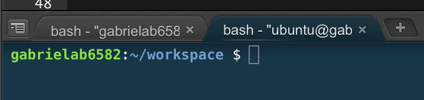

# GitHub Tutorial

_by Gabriela Bochen_

---
## Git vs. GitHub

 * Git 
    * version control method used for tracking changes in folders and files.
    * Saves "Snapshots" of code
    
* Github 
    *   is a platform used for storing code in a cloud (on the web) 
    *   Requires Git
    *   Visually tracks code
     

  
  
  
 
---
## Initial Setup

1. Open and log into Cloud9 
2. Open and log into Github
4. In Github, open settings and on the left side bar open "SSH and GPG keys"
5. Press green button "New SSH Key"
6. Type in title. Make it relavent to your Local 
7. For the "Key": Switch into cloud9 > Press gear icon > SSH keys tab > copy and paste the second SSH Key provided 
8. Switch back into Github and paste the SSH Key
9. In Cloud9 open Workspace
10. In the command line type _"ssh -T git@github.com"_ A message should apprears that says you've successfully authenticated. 

---
## Repository Setup
##### Creating a Repository and files on c9
 Before making a directory/repository, the command line must show that you are currently in workspace. It should look like the image below. If you are not in Workspace you must use `cd ..` until you reach the worskapce.   
 
 
 When that is done, the directory is ready to be created   
 By using the command `mkdir [INSERT NAME]` you are creating a new directory.   
 
Next `cd [NAME]`   By doing this, it allows you to move into that directory.   

Following that, you must use the comand `git init` This will create a repository were you can create, save, store and edit work or files.

Now in this repository you can create a file.   
The command `touch [NAME]` is to make that file.  
Open the file and edit as wished.  

Next, Save add and commit: 
* to Save either press ⌘S or turn on autosave
* To add `git add .` 
* to commit `git commit -m "[MESSAGE]"`

##### __Creating a Repository on Github__

Now after recording the changes to your _local_. The next step is creating a Repository on Github. This will allow for the current work to be sent up to Github which known as the _remote_.   

1. Go to Github 
2. click to top right "+" 
3. Choose new Repository 
4. name the repository the same name as you repository in c9 (local). 
5. After pressing the "create repository" button gitbuh brings you to a page like **THIS**
6. At the top there is an option for either an HTTPS or SSH link those the link for the SSH 
7. Then copy and paste the two links found in the middle of the page to the command line . They should look like this : 
 `git remote add origin git@github.com:gabrielab6582/name.git   ` and 
`git push -u origin master`  

Now Github has been connected to c9. 

--- 

## Workflow & Commands

##### What is `git status`?

`git status` is a command used to check whether a file is in the staging area. It also shows if the file is ready or has been commite already. 

##### What is `git add`?
`git add` is a command used to add files to the staging area. `git add .` is used to add all files to the stage to be committed. `git add --all` is used  to add all renamed or deleted files to the stage to be committed.  

##### What is `git commit`? 

`git commit -m ""` is the command used to save changes in the local repository.  

The Message in the quotes should be revelent and related to the edits made. This is good for orginization of work. 

##### What is `git push`? 

`git push` is used to upload the additons made in a file to its remote, in this case github.   

In order for `git push` a connection between the local and remote must be made. View section "Creating a Repository on Github" on how to do this. 

---
## Rolling Back Changes

##### Undo Edit 
You made an edit and now you want to go back to the pervious edit .Type git status. Read what it says. It should tell you to use `git checkout -- <file>...` This command undo's any edit you made to the file that you changed.

##### Undo Add 
In the case where you add an edit to the staging area and then decide that you want to undo it, use `git reset HEAD filename`.   
 
 By doing this you will take that specific file out of the staging area. 
 
##### Undo Commit

There a tons of situtations where you will want to undo a previous commit made.    
* `git reset HEAD~1` works by removing the commit and removing it from the staging area but still keeping its edits. 
* `git reset --soft HEAD~1` works by removing the commit but still keeping the file's edits and in the staging area. 
* `git reset --hard HEAD~1` this command will remove the commit, take it off the staging area AND undo the edits. In the end the file will look like the previous commit made. 

##### Undo Push

you just ran git push, sending your changes to GitHub, now you realize there’s a problem with one of those commits. You’d like to undo that commit. 

To undo a push you type `git log` which shows you a log of your previous commits. There will you see the SHA key of your commit. Then you can do `git revert` with the SHA numbers, which undo's your push.

